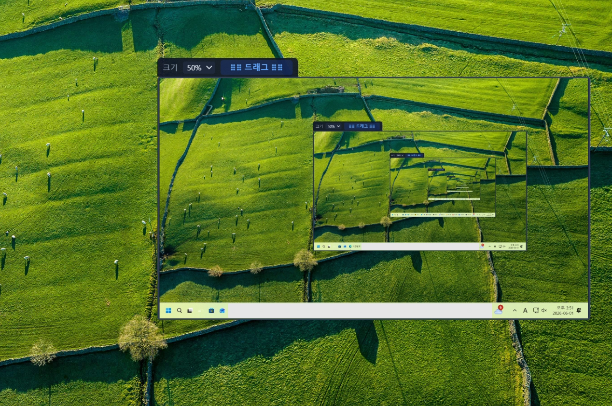

# ClassEyeT

**학교 PC실 교사-학생 수업 플랫폼**

> **ClassEyeT**는 학교 PC실에서 교사가 학생 화면을 모니터링하고, 화면을 송출하며, 파일을 배포/회수하고, 수업을 통제할 수 있는 올인원 수업 플랫폼입니다.

---

## 📸 주요 화면

<table>
<tr>
<td width="50%"></td>
<td width="50%"></td>
</tr>
<tr>
<td align="center"><b>교사 앱 — 학생 모니터링 + 송출 제어</b></td>
<td align="center"><b>학생 앱 — 플로팅 바로 메시지 전송</b></td>
</tr>
</table>

---

## 기능

- **화면 송출**: WebP / H.264 모드, 전체·선택 송출, 단축키
- **모니터링**: 실시간 썸네일, 개별 뷰어, 원격 제어, 중계, PC 원격 켜기(WoL)
- **파일**: 배포·회수·실행·관리, 텍스트·코드·이미지 전송
- **수업 통제**: 잠금 모드, 집중 모드, 타이머, 공지, 프로그램 종료·차단
- **소통**: 학생 플로팅 바(메시지·도움·완료·신고), 채팅
- **안정성**: 워치독 자동 복구, 잠금 안전망

---

## 다운로드 · 설치

| | 방법 |
|---|---|
| **교사 PC** | [Releases](../../releases/latest) → `ClassEyeT-Setup-x.x.x.exe` |
| **학생 PC** | 교사 앱 → **도구 → 학생 설치 패키지 만들기** 로 맞춤 패키지 생성 |

---

## 시스템 요구사항

Windows 10/11, 1 Gbps LAN, 교사 RAM 8GB+

---

## 단축키

| 키 | 동작 |
|---|---|
| `F6` | 전송 시작/종료 |
| `F7` | 전송 일시정지/재개 |
| `F8` | 녹화 시작/종료 |

*도구 → 단축키 설정* 에서 변경 가능합니다.

---

## 개발

Electron · React · TypeScript · Tailwind CSS

---

## 라이센스

교육 목적 비상업적 사용에 한해 무료.

---

**개발: 세명컴퓨터고등학교**

문의·버그 제보는 [Issues](../../issues) 에 등록해 주세요.

